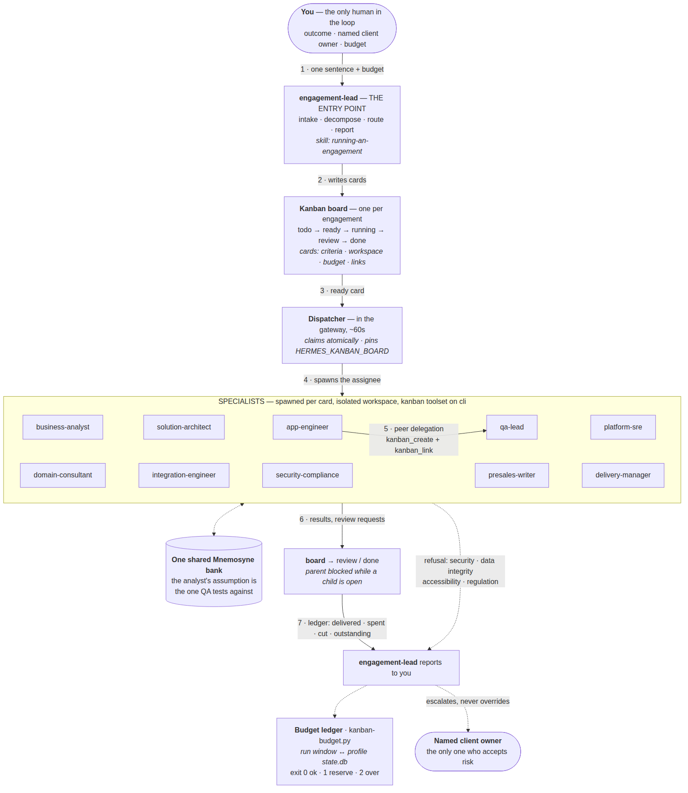
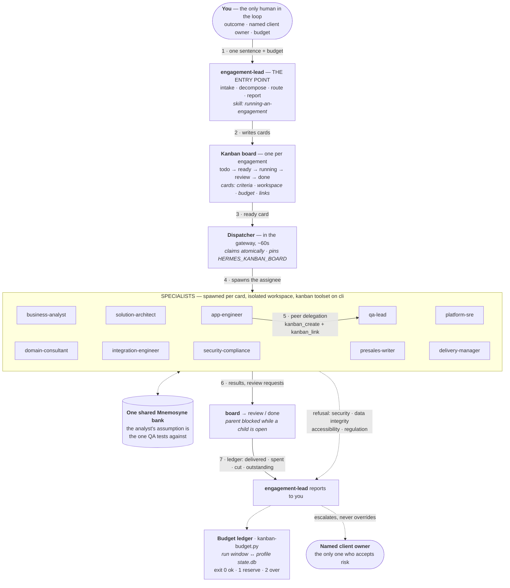

# IT outsourcing delivery team profiles

Eleven Hermes profiles covering how a software services company actually delivers into
somebody else's business, each with its own SOUL and each wired to Mnemosyne. Optional: the
memory installers in the repository root do not need this, and this needs them to have run
first.

| Script | Platform |
| --- | --- |
| `install-outsourcing-team-unix.sh` | Linux / macOS |
| `install-outsourcing-team-windows.ps1` | Windows (PowerShell 5.1+) |

## How this differs from `sdlc-team`

`sdlc-team` is a product team: it owns the code, the roadmap and the risk. This team does not.
Every soul here is written for the vendor side of a contract, which changes the defaults:

- **The client owns the code, the data and the decision.** Risk acceptance belongs to a named
  human on the client side. A specialist's refusal is escalated to that person, never
  overridden internally — not even by the engagement lead.
- **Scope is contractual.** A "quick clarification" may be a change request, and saying so is
  somebody's explicit job rather than an afterthought.
- **The estate already exists and is only partly visible.** Designs are constrained by
  incumbent platforms and by what the client's own team can operate.
- **The engagement ends.** Handover, runbooks, credential transfer and the client team's
  ability to run the thing without us are deliverables, not paperwork.
- **Industry-neutral, industry-aware.** One profile exists purely to supply the vertical
  knowledge — manufacturing, finance, e-commerce, healthcare, public sector — that the
  engineers do not have.

## The profiles

| Profile | Role |
| --- | --- |
| `engagement-lead` | Client relationship, commercial framing, escalation, scope boundary, exit |
| `delivery-manager` | Decomposes outcomes into cards, sequences work, manages burn and margin |
| `business-analyst` | Elicits and traces requirements into testable acceptance criteria |
| `domain-consultant` | Industry vocabulary, regulatory constraints, real operational edge cases |
| `solution-architect` | Boundaries, contracts and technology commitments inside the client's estate |
| `app-engineer` | Builds features end to end, in the client's codebase and conventions |
| `integration-engineer` | Interfaces to unchangeable systems; data migration with reconciliation |
| `qa-lead` | Acceptance evidence, traceability, client UAT, regression, exit criteria |
| `platform-sre` | Pipelines, environments, telemetry — handed over operable |
| `security-compliance` | Threat models, security findings, control and evidence gaps |
| `presales-writer` | Proposals, SOW scope language, assumptions and exclusions, status reports |

Each profile's personality is `souls/SOUL-<name>.md`, copied to the profile's `SOUL.md`. Edit a
soul and re-run to push the change. Each description is also registered with `hermes profile
describe`, which is what the kanban decomposer routes tasks on — so tasks are matched by role
rather than by profile name alone.

## Prerequisites

Hermes must already be installed with Mnemosyne as the active memory provider:

```bash
../install-mnemosyne-hermes-unix.sh --disable-builtin-memory
```

`--disable-builtin-memory` matters here beyond the usual context argument. `hermes profile
create --clone` copies `config.yaml` as a **file**, so whatever is set on the root profile at
clone time is what every profile is created with. Turn the built-in store off first and all
eleven inherit that; turn it off afterwards and you have changed only the root. Both scripts
refuse to run when `memory.provider` is not `mnemosyne`, and warn when the built-in store is
still on.

## Install

Linux / macOS:

```bash
./install-outsourcing-team-unix.sh
```

| Flag | Effect |
| --- | --- |
| `--model MODEL` | Model to set on each profile (default: `anthropic/claude-sonnet-5`) |
| `--only a,b,c` | Create only these profiles instead of all eleven |
| `--prefix PREFIX` | Prepend `PREFIX` to every profile name, e.g. `--prefix os-` → `os-qa-lead` |
| `--skip-model` | Leave each profile's model at whatever it inherited |
| `--keep-soul` | Do not overwrite an existing `SOUL.md` |
| `--separate-memory` | Give each profile its own Mnemosyne database instead of the shared one |
| `--dry-run` | Print the plan and change nothing |
| `-h`, `--help` | Show usage |

Windows:

```powershell
.\install-outsourcing-team-windows.ps1
```

| Flag | Effect |
| --- | --- |
| `-Model MODEL` | As above |
| `-Only a,b,c` | As above |
| `-Prefix PREFIX` | As above |
| `-SkipModel` | As above |
| `-KeepSoul` | As above |
| `-SeparateMemory` | As above |
| `-DryRun` | As above |

`--skip-model` and `--model` are mutually exclusive; passing both is an error rather than a
silent precedence rule. An unrecognised name in `--only` is also an error, rather than a
successful run that created nothing.

Re-running is safe: existing profiles are updated in place — SOUL, model and plugin link —
rather than erroring out on the name.

### Running alongside `sdlc-team`

No profile name here collides with the nine in `sdlc-team`, so both teams can be installed at
once. `--prefix` exists for the other case: running two *engagements* of this same team side by
side, each with its own board and history.

```bash
./install-outsourcing-team-unix.sh --prefix acme-
```

Profiles created this way still share the one team memory bank. If the two engagements must not
see each other's notes, add `--separate-memory` so each profile keeps its own database.

## Why each profile needs its own plugin link

This is the part that is easy to get wrong, and it fails quietly.

A named profile redirects `HERMES_HOME` to its own directory, and Hermes discovers memory
providers under `$HERMES_HOME/plugins/`. The Mnemosyne plugin is installed once, at the root.
So a freshly cloned profile ends up with `memory.provider: mnemosyne` in its config — copied
from the root — and no plugin to satisfy it:

```text
Provider:  mnemosyne
Plugin:    NOT installed ✗
```

Hermes does not fail on this. The profile runs with no memory at all, and the only sign is a
status line nobody thinks to check. Both scripts close the gap by linking each profile's
`plugins/mnemosyne` back to the single real install, then verifying `memory status` reports
`available` for every profile before exiting — non-zero if any does not.

On Unix that link is a symlink. On Windows it is a directory junction, because a symlink there
needs Developer Mode or elevation while a junction needs neither. If even a junction cannot be
created, the Windows script copies the plugin and says so: a copy loads fine, but a later
`mnemosyne-hermes install --force` upgrades only the original, so re-run this script after
upgrading Mnemosyne.

## Running an engagement: the entry point, delegation and budgets

The team is driven through Hermes' built-in kanban. `engagement-lead` is the entry point — the
profile a human talks to. It decomposes the outcome into cards, assigns specialists, and
reports; the other ten are workers the dispatcher spawns.

### How the team communicates

You talk to one bot. Everything below it is spawned by the dispatcher and reports back through
the board.



A themed, higher-detail version is in
[`docs/communication-diagram.html`](docs/communication-diagram.html) — open it in a browser, or
drop it in a Hermes desktop chat with `::preview{file="..."}`. The source of the diagram below
is the Mermaid block; GitHub renders it inline.



Three things the arrows are load-bearing about:

- **Escalation is one-directional.** A specialist's refusal goes worker → `engagement-lead` →
  the named client owner. The lead inherited scheduling authority, not the authority to accept
  risk, so it escalates rather than overrules. That is what makes the team safe unattended.
- **Peer delegation is the design, not a side effect.** `app-engineer` raising a `qa-lead` card
  for the e2e suite is a verified path; `kanban_link` makes the dependency real so the parent
  cannot reach `done` while the child is open.
- **Every worker must end on `kanban_complete` or `kanban_block`.** Exiting cleanly without one
  is a protocol violation, gets retried, and ends blocked — which is how a bad `--model` shows
  up as "spawn failures" rather than "bad model name".

### Starting an engagement

```bash
hermes kanban boards create acme-portal --name "Acme order portal"
hermes kanban boards switch acme-portal
hermes -p engagement-lead chat          # give it the outcome, the owner and the budget
```

The installer wires three things that make this work:

- **The kanban toolset, on every profile.** It ships disabled by default, and dispatcher-spawned
  workers inherit their profile's *CLI* toolsets — so without this a worker silently has no
  `kanban_create`/`kanban_link` and cannot hand work on.
- **The `running-an-engagement` skill** on the entry point: intake checklist, how to write a
  card a specialist can execute, routing table, model tiers, the degradation ladder, and the
  stop conditions.
- **`bin/kanban-budget.py`** on the entry point, because kanban has no native cost tracking.

`--no-kanban` skips all three.

### Specialists delegate to each other

A worker can raise a card for a sibling rather than doing a job outside its competence. Tell it
to in the card body, and the chain runs unattended. Verified end to end: given one sentence and
an $8 budget, `engagement-lead` wrote the brief and an implementation card, `app-engineer` built
the feature and raised a linked `qa-lead` card for Playwright e2e tests, and QA delivered a
passing suite — three cards, no human in the loop.

`--parent` / `kanban_link` makes the dependency real: a parent does not reach `done` while
children are open, which is what stops a feature being called finished before its tests exist.

> **Pass a real model id to `--model`, never a tier word.** `--model mid` fails with
> `HTTP 404: model: mid`; the worker dies before it can call `kanban_complete` or
> `kanban_block`, so the dispatcher logs a *protocol violation* and retries until the card
> blocks. Nothing says "bad model name" until you read the worker's own output. Omit `--model`
> to inherit the profile default, or clear a bad one with `hermes kanban set-model <id> none`.

### Budgets

```bash
kanban-budget.py --set-budget 40     # once per board
kanban-budget.py                     # per-role, per-card, total, % spent
kanban-budget.py --json              # machine-readable
```

`tasks.session_id` is NULL for dispatcher-spawned workers, so spend is recovered by correlating
each run's profile and time window against that profile's own `state.db` sessions. That
correlation is the one inference in the tool and it is reported as such: sessions it cannot tie
to a run appear as `Unattributed` rather than being silently dropped, so the total is never
quietly wrong. Exit codes gate a run — `0` fine, `1` into the closeout reserve, `2` exhausted.

## The shared memory bank, and the second silent failure

Linking the plugin shares Mnemosyne's **code**. It does not share its **data**, and that
distinction cost this package a real bug.

Mnemosyne resolves its database from `MNEMOSYNE_HOME`, which defaults to
`$HERMES_HOME/mnemosyne` — and a named profile has already redirected `HERMES_HOME` to its own
directory. So every profile quietly gets its *own* database. Both profiles report
`Status: available`, nothing errors, and the failure only shows up as an agent that cannot
remember something a sibling wrote:

```text
business-analyst  → stores ASSUMPTION A-17
qa-lead           → mnemosyne_recall("A-17") → 0 results
```

For a team whose whole purpose is handing work between roles — the analyst records an
assumption, the QA lead tests against it, the engagement lead reports on it — that is fatal and
invisible. Setting `MNEMOSYNE_HOME` in a profile's `.env` does **not** fix it; that variable is
not read on this path. Both scripts therefore link each profile's `mnemosyne/` data root to the
one real store, the same way they link the plugin, and print which bank is in use at the top of
every run.

Verified end to end: with the link in place, `business-analyst` stores an assumption and both
`qa-lead` and `solution-architect` recall it verbatim.

If a profile already has a real `mnemosyne/` directory with its own history, neither script
touches it — it says so, names the profile in a closing warning, and leaves the data alone for
you to merge or delete. Nothing is ever deleted to force sharing.

`--separate-memory` / `-SeparateMemory` opts out, giving each profile its own database. Use it
for genuinely independent agents, not for a team: roles then cannot read each other's notes.

> `memory.mnemosyne.profile_isolation: true` is a *different* mechanism (per-profile banks
> inside one store) and has the same consequence — it also breaks cross-role recall. Leave it
> `false` for this team.

## Uninstall

There is no separate uninstaller. Profiles are removed one at a time, which also deletes that
profile's sessions and history:

```bash
hermes profile delete engagement-lead
```

The root install and the shared memory database are untouched by that; the repository-root
uninstallers handle those, and they already unset `memory.provider` in every profile.
